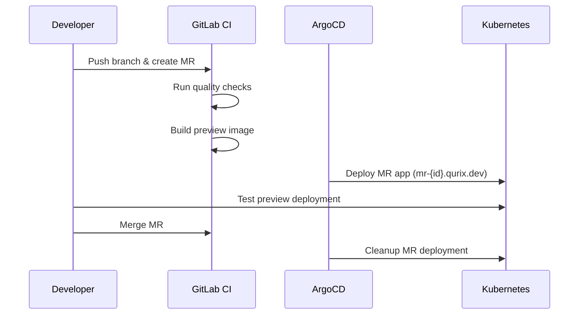
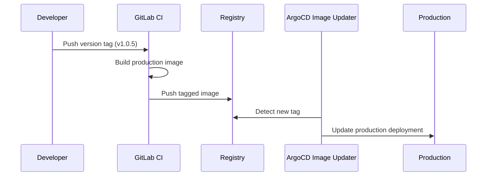

# Webserver

A Next.js React application for demonstration purposes.

## Features

Built with the Next.js React framework, this webserver provides a modern web application experience with server-side rendering and client-side interactivity.

The application accepts a `NEXT_PUBLIC_CONFIG_VALUE` environment variable which is rendered and displayed on the client side for showcasing configuration capabilities.

## Development Lifecycle

### Testing & Preview Deployments

1. **Create a feature branch:**
   ```bash
   git checkout -b feature/my-new-feature
   git push origin feature/my-new-feature
   ```

2. **Create a Merge Request:**
   - Navigate to GitLab and create an MR from your branch
   - The CI pipeline automatically runs quality checks (linting, type-checking, tests)
   - A preview deployment is created using ArgoCD ApplicationSet MR generator
   - Access your deployed application at: `https://webserver-mr-{MR_ID}.qurix.dev/`
   - Example: `https://webserver-mr-8.qurix.dev/`

The preview deployment remains active for the entire lifespan of the merge request and is automatically cleaned up when the MR is merged or closed.

### Production Releases

1. **Create and push a version tag:**
   ```bash
   git tag v1.0.5
   git push origin v1.0.5
   ```

2. **Automated deployment:**
   - The CI pipeline builds a production Docker image
   - ArgoCD Image Updater automatically detects the new tag
   - Production deployment is updated with the new version

**Tag format:** Use semantic versioning tags in the format `v{MAJOR}.{MINOR}.{PATCH}` (e.g., `v1.0.5`, `v2.1.0`)

## Workflow Diagrams

### Development & MR Preview Flow



### Production Release Flow



## Environment Variables

- `NEXT_PUBLIC_CONFIG_VALUE`: Demo configuration value displayed on the client side